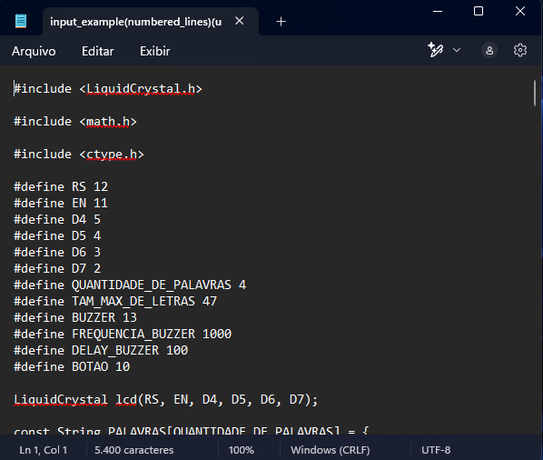

# NumLines

Old script that enumerates lines of a text file. I made it for fun because I needed to number hundreds of lines of a few codes (to put them in a technical report).

## How to use

The program expects 4 command line arguments to be passed in this specific order: operation(op), input filename(source), output filename(dest) and empty separation(empty_sep). 

There are only two operations (1, which which can be used to enumerate lines, and 2, which can be used to remove numbered lines written by this program). 

The input filename is the text file that will have its lines numbered. The output filename is where and in what name the numbered file will be written on. If not given, it will use the input filename as the basename and append "(numbered_lines)" or "(unumbered_lines) to it, dependending on the operation.

Empty separation is the number of white spaces between the number and the text. If not given, 2 whitespaces will be used by default.

## Examples 

`python num_lines.py 1 input_file.txt output.txt 0`
`python num_lines.py 1 input_file.txt`
`python num_lines.py 2 input_file(numbered_lines).txt`

## Images

### Original file

### Numbered file

### Unnumbered file

